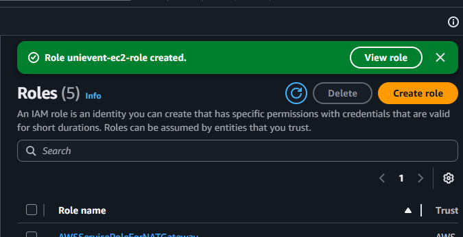
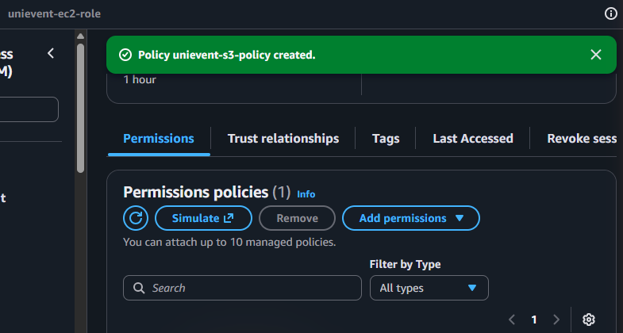
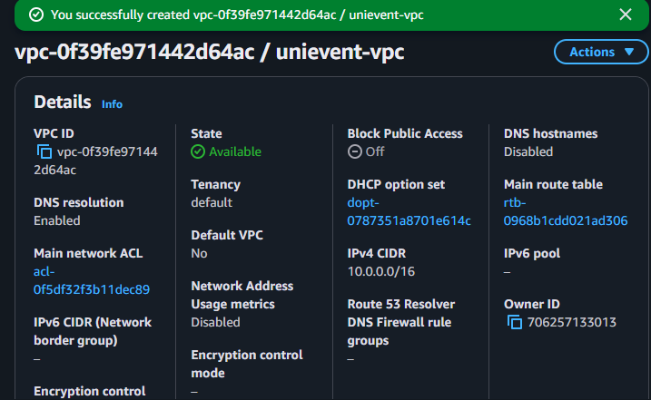
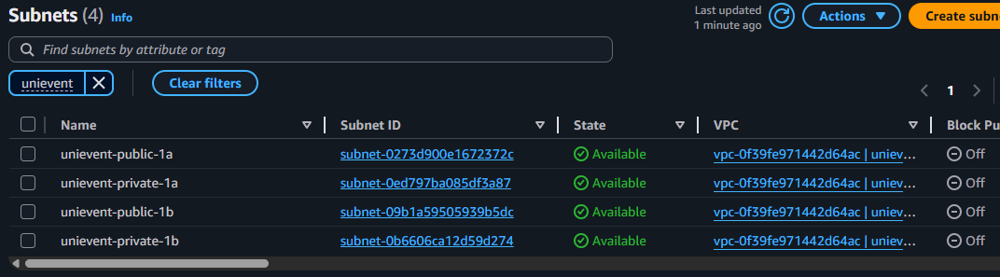
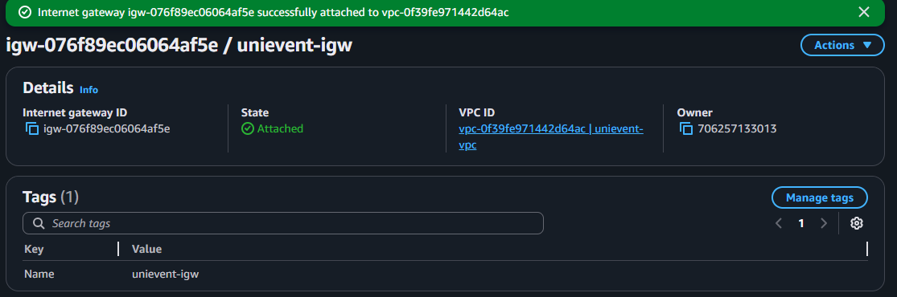
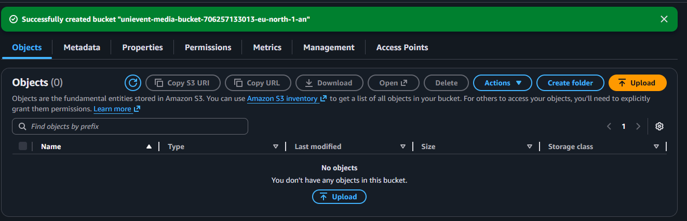
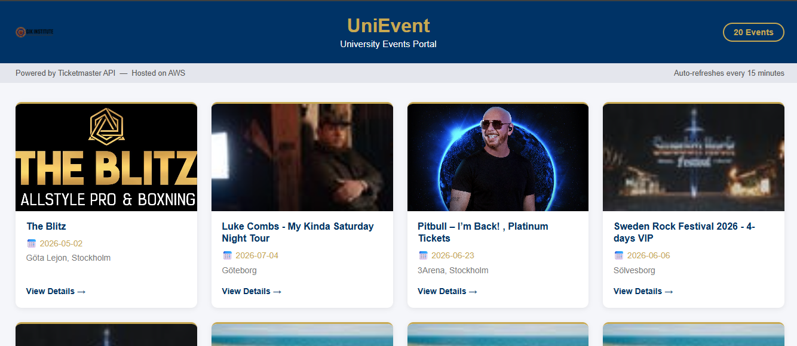
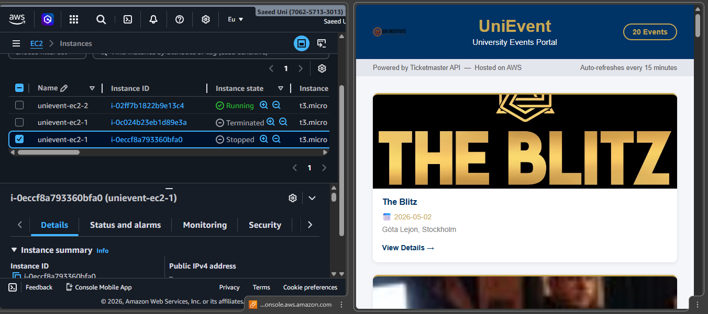

# UniEvent -- AWS Deployment
## CE308/408 Cloud Computing | GIKI

A Flask-based university events portal that fetches live data from the Ticketmaster API, deployed on AWS with multi-AZ EC2 instances, an Application Load Balancer, and S3 for static assets.

   

---

## Project Overview

UniEvent is a cloud-hosted events portal built for the CE308/408 Cloud Computing assignment at GIKI. The application pulls real-time music, sports, and arts events from the Ticketmaster Discovery API and presents them in a GIKI-branded interface. It is deployed across two Availability Zones on Amazon EC2, fronted by an Application Load Balancer, demonstrating fault-tolerant, production-grade AWS architecture.

| Component | Service | Purpose |
|---|---|---|
| Web Application | Amazon EC2 (x2) | Hosts the Flask/Gunicorn app in two AZs |
| Load Balancer | Application Load Balancer | Distributes traffic; performs health checks |
| Virtual Network | Amazon VPC | Isolates all resources in a private network |
| Subnets | Public + Private Subnets | Public for ALB, private for EC2 instances |
| Internet Gateway | IGW | Allows inbound traffic from the internet |
| Static Assets | Amazon S3 | Stores the GIKI logo and any media assets |
| IAM | IAM Role + Inline Policy | Grants EC2 least-privilege access to S3 |
| External Data | Ticketmaster Discovery API | Provides live event listings |

---

## Architecture

```
Internet
    │
    ▼
┌─────────────────────────────────────────────────────────┐
│  Internet Gateway (IGW)                                 │
└───────────────────────────┬─────────────────────────────┘
                            │
                            ▼
┌─────────────────────────────────────────────────────────┐
│  Application Load Balancer  (Public Subnets)            │
│   eu-north-1a              eu-north-1b                  │
└───────────────┬────────────────────────┬────────────────┘
                │                        │
     ┌──────────▼──────────┐  ┌──────────▼──────────┐
     │  Private Subnet 1   │  │  Private Subnet 2   │
     │  EC2 Instance  (AZ1)│  │  EC2 Instance  (AZ2)│
     │  Flask + Gunicorn   │  │  Flask + Gunicorn   │
     └──────────┬──────────┘  └──────────┬──────────┘
                └──────────┬─────────────┘
                           │
                ┌──────────▼──────────┐
                │     Amazon S3       │
                │  unievent-media-    │
                │  bucket             │
                └─────────────────────┘
```

All EC2 instances sit in private subnets with no direct internet exposure. Only the ALB in the public subnets accepts inbound HTTP traffic on port 80, forwarding it to EC2 instances on port 5000. The instances reach S3 via an IAM instance role, and the Ticketmaster API is called outbound through a NAT Gateway (or public subnet routing as configured).

---

## Repository Structure

```
Assignment1_AWS_CE/
├── app/
│   ├── app.py                  # Flask application (routes, APScheduler, Ticketmaster fetch)
│   ├── requirements.txt        # Pinned Python dependencies
│   ├── .env                    # Local dev secrets (git-ignored)
│   ├── static/
│   │   └── giki-logo-1.png     # GIKI crest served by Flask
│   └── templates/
│       └── index.html          # Jinja2 template (GIKI-branded events grid)
├── infra/
│   └── userdata.sh             # EC2 User Data bootstrap script
├── docs/
│   └── screenshots/            # Deployment screenshots (referenced below)
├── giki-logo-1.png             # Source logo
├── .gitignore
└── README.md
```

---

## Deployment Steps

### Step 1 -- IAM Role

Create a dedicated IAM role so EC2 instances can access S3 without embedding credentials. Attaching an inline policy enforces least-privilege by granting only the specific S3 actions the application needs.

1. Open the **IAM** console and choose **Roles → Create role**.
2. Select **Trusted entity type: AWS service** and use case **EC2**, then click **Next**.
3. Skip the managed-policy screen and click **Next** through to **Name, review, and create**.
4. Name the role `UniEvent-EC2-Role` and click **Create role**.
5. Open the newly created role, choose **Add permissions → Create inline policy**.
6. Switch to the **JSON** tab and paste the policy below, then name it `UniEventS3Access`.

```json
{
  "Version": "2012-10-17",
  "Statement": [
    {
      "Sid": "UniEventS3Access",
      "Effect": "Allow",
      "Action": [
        "s3:GetObject",
        "s3:PutObject",
        "s3:ListBucket"
      ],
      "Resource": [
        "arn:aws:s3:::unievent-media-bucket",
        "arn:aws:s3:::unievent-media-bucket/*"
      ]
    }
  ]
}
```




---

### Step 2 -- VPC and Networking

Create an isolated Virtual Private Cloud with public subnets (for the ALB) and private subnets (for EC2) across two Availability Zones. This separation ensures that application servers are never directly reachable from the internet.

#### 2a -- Create the VPC

1. Open **VPC → Your VPCs → Create VPC**.
2. Select **VPC only**, name it `UniEvent-VPC`, set IPv4 CIDR to `10.0.0.0/16`.
3. Click **Create VPC**.

#### 2b -- Create Subnets

1. Go to **Subnets → Create subnet**, select `UniEvent-VPC`.
2. Create all four subnets below in separate steps:

| Name | AZ | CIDR | Type |
|---|---|---|---|
| UniEvent-Public-1 | eu-north-1a | 10.0.1.0/24 | Public (ALB) |
| UniEvent-Public-2 | eu-north-1b | 10.0.2.0/24 | Public (ALB) |
| UniEvent-Private-1 | eu-north-1a | 10.0.3.0/24 | Private (EC2) |
| UniEvent-Private-2 | eu-north-1b | 10.0.4.0/24 | Private (EC2) |

#### 2c -- Internet Gateway

1. Go to **Internet Gateways → Create internet gateway**, name it `UniEvent-IGW`.
2. After creation, select it and choose **Actions → Attach to VPC** → select `UniEvent-VPC`.

#### 2d -- Route Table for Public Subnets

1. Go to **Route Tables → Create route table**, name it `UniEvent-Public-RT`, attach to `UniEvent-VPC`.
2. Select the route table → **Routes → Edit routes → Add route**: Destination `0.0.0.0/0`, Target `UniEvent-IGW`.
3. Go to **Subnet associations → Edit → Associate** `UniEvent-Public-1` and `UniEvent-Public-2`.

#### 2e -- Enable Auto-assign Public IP on Public Subnets

1. Select `UniEvent-Public-1` → **Actions → Edit subnet settings**.
2. Enable **Auto-assign public IPv4 address**. Repeat for `UniEvent-Public-2`.






---

### Step 3 -- Security Groups

Two security groups are chained so that EC2 instances only accept traffic originating from the ALB, not from the open internet. This is enforced by using the ALB security group itself as the source rule on the EC2 security group.

1. Go to **VPC → Security Groups → Create security group**.
2. Create `UniEvent-ALB-SG` in `UniEvent-VPC`. Add inbound rule: **HTTP (80)** from `0.0.0.0/0`.
3. Create `UniEvent-EC2-SG` in `UniEvent-VPC`. Add inbound rule: **Custom TCP port 5000**, source = `UniEvent-ALB-SG` (select the SG ID, not a CIDR).


---

### Step 4 -- S3 Bucket

An S3 bucket stores the GIKI logo and any other static media assets. EC2 instances access it using the IAM role created in Step 1, so no public bucket policy is needed.

1. Open **S3 → Create bucket**.
2. Name it `unievent-media-bucket`, region `eu-north-1`.
3. Leave **Block all public access** enabled.
4. Upload `giki-logo-1.png` to the bucket.



---

### Step 5 -- EC2 Instances

Two EC2 instances are launched in separate private subnets (one per AZ) so the ALB can distribute traffic and failover automatically if one instance becomes unhealthy.

1. Open **EC2 → Launch instance**.
2. Choose **Amazon Linux 2023 AMI**, instance type **t2.micro**.
3. Select `UniEvent-VPC`, subnet `UniEvent-Private-1`, security group `UniEvent-EC2-SG`.
4. Under **IAM instance profile**, choose `UniEvent-EC2-Role`.
5. Expand **Advanced details → User data**, paste the full contents of `infra/userdata.sh` (replace `REPLACE_WITH_YOUR_KEY` with your Ticketmaster key first).
6. Name the instance `UniEvent-EC2-AZ1` and launch.
7. Repeat steps 1-6 using subnet `UniEvent-Private-2`, naming the instance `UniEvent-EC2-AZ2`.


---

### Step 6 -- Application Load Balancer

The ALB acts as the single entry point for all traffic, balancing requests between the two EC2 instances and performing health checks to detect failures. It listens on port 80 (HTTP) and forwards to port 5000 on the instances.

1. Open **EC2 → Load Balancers → Create load balancer → Application Load Balancer**.
2. Name it `UniEvent-ALB`, scheme **Internet-facing**, IP address type **IPv4**.
3. VPC: `UniEvent-VPC`. Mappings: select `eu-north-1a` + `UniEvent-Public-1` and `eu-north-1b` + `UniEvent-Public-2`.
4. Security group: `UniEvent-ALB-SG`.
5. **Listeners and routing → Create target group**:
   - Target type: **Instances**, name `UniEvent-TG`, protocol **HTTP**, port `5000`.
   - Health check path: `/health`.
   - Register both EC2 instances as targets.
6. Set the listener (port 80) to forward to `UniEvent-TG`.
7. Click **Create load balancer**.


---

### Step 7 -- Ticketmaster API

The application calls the Ticketmaster Discovery API to fetch live event listings. A free developer account provides a Consumer Key with a generous rate limit (5 requests/second, 5000/day) which is sufficient for this use case.

1. Register at [developer.ticketmaster.com](https://developer.ticketmaster.com) and create a new app.
2. Copy the **Consumer Key** from the app dashboard.
3. In `infra/userdata.sh`, find the line `TICKETMASTER_API_KEY=REPLACE_WITH_YOUR_KEY` inside the `.env` heredoc and paste your key after the `=`.
4. Alternatively, SSH into each EC2 instance and update `/home/ec2-user/unievent/.env` directly, then restart gunicorn.

---

### Step 8 -- Testing and Fault Tolerance

Once the ALB is provisioned, copy its DNS name from the console and open it in a browser to verify the events portal loads correctly. To test fault tolerance, stop one EC2 instance and confirm the site remains available through the second instance.

1. Open **EC2 → Load Balancers**, select `UniEvent-ALB`, copy the **DNS name**.
2. Paste the DNS name into a browser -- the UniEvent portal should display live events.
3. Open **EC2 → Instances**, select `UniEvent-EC2-AZ1`, choose **Instance state → Stop**.
4. Reload the browser -- the site should continue serving from `UniEvent-EC2-AZ2` with no downtime.
5. Confirm in the **Target Group → Targets** tab that AZ1 shows `unhealthy` and AZ2 shows `healthy`.




---

## Security Design

- **Private subnets for EC2** -- application servers have no public IP and cannot be reached directly from the internet; all inbound traffic flows through the ALB.
- **Security group chaining** -- `UniEvent-EC2-SG` allows port 5000 only from `UniEvent-ALB-SG`, so even internal VPC traffic is restricted to the load balancer.
- **IAM instance role (least privilege)** -- EC2 instances authenticate to S3 via an attached role with only `GetObject`, `PutObject`, and `ListBucket` on the specific bucket, with no long-lived access keys stored on disk.
- **S3 Block Public Access enabled** -- the media bucket is not publicly accessible; objects are served through the Flask application which holds the IAM role credentials automatically.
- **API key via environment variable** -- the Ticketmaster key is loaded from a `.env` file excluded from version control via `.gitignore`, preventing accidental exposure in the repository.

---

## External API Justification

Ticketmaster was chosen for its broad event coverage, stable free tier, and straightforward API key authentication, making it the most practical choice for a university deployment project.

| API | Free Tier | Auth | Key Fields Available | Verdict |
|---|---|---|---|---|
| **Ticketmaster** | 5000 req/day | API key (header/param) | name, date, venue, city, image, URL, classification | **Selected** -- generous quota, rich fields, no approval wait |
| Eventbrite | 2000 req/day | OAuth 2.0 | name, date, venue, description | Rejected -- OAuth adds setup complexity; fewer image assets |
| PredictHQ | 1000 req/month | Bearer token | name, date, category, rank | Rejected -- very low monthly quota; no event images |

---

## Fault Tolerance

The ALB continuously sends HTTP GET requests to the `/health` endpoint on each registered EC2 instance. If an instance fails to respond with HTTP 200 for a configurable number of consecutive checks (default: 2 failures), the ALB marks it `unhealthy` and stops routing new requests to it, directing all traffic to the remaining healthy instance in the other Availability Zone. Because the two instances run in `eu-north-1a` and `eu-north-1b` respectively, a single AZ outage cannot take down the application; the surviving instance continues to serve the full workload until the failed instance recovers and passes health checks again.
